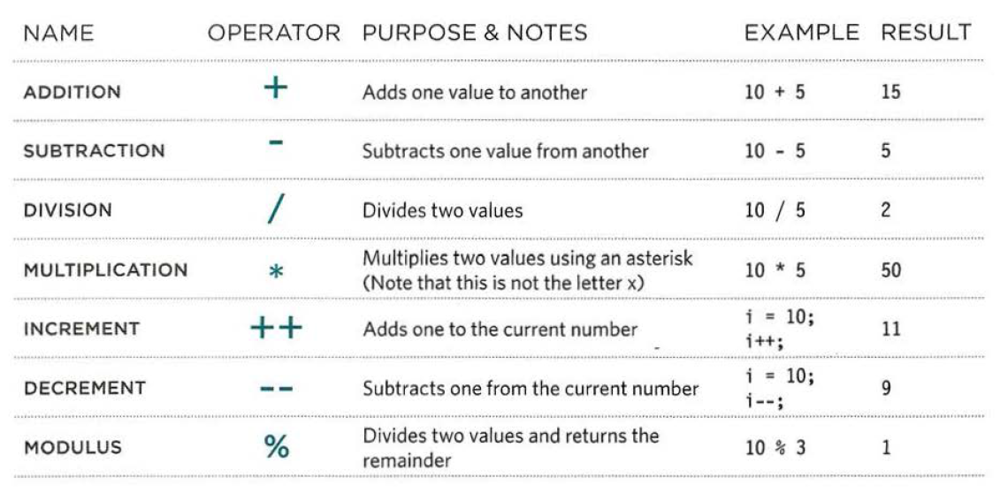

# Class 01

## How websites are created?

All websites use HTML, CSS, and other technolgies could be used based on the type of the wesbite.

## How the web works?

Websites are hosted on servers that could be anywhere in the world. The browser you're using knows how to find the website you want access using DNS (Domain Name System).

## Structure
HTML is short for Hypertext Markup Language which is used to build and create webpages using elements called tags. Each HTML tag tells the browser something about the information that lays between its openning and closing. HTML tags can be divided into two types: openning tag and closing tag.

The HTML openning tag consists of 3 parts; `<`, `>`, and the value between them, and the HTML closing tag has the same elements in addition to `/` that comes directly after `<`. Also, There are some tags that don’t need a closing tag, there are called self-closing tags or void tags.

Example:

`<p></p>` ``

Another thing that tells us more about the elements is called attrubute. Attributes provide more information about the contents and element. Attributes can be seen in the openning tag of an element, and they require a name and a value.

Example:

``

## HTML Layout
In HTML 5, the elements started to indicate the purpose of different part of the HTML document and help to organize and describe the structure of the document.

Example:

`<footer></foooter>` This tag is used as the last section of the document which includes the copurights of the website and some useful links. When a user sees this tag, the user would know what it is.

The problem is that some old browsers such as IE8 doesn’t support HTML5, and to make it work on that browser you might need to add extra javascript code so the brwoser starts to identify HTML5.

## Process and Design
When you’re designing your website, it is really important to build it in a way that attracts your targeted audience, and the website should also have the information that needed by that audience to give them a reason to visit your website.

It is recommended to use site maps when you’re building your website, since site maps allows you to plan the structure of the site you want to build. In addition to site maps, Wireframes also help in the same matter. Wireframes allows you to organize the information and on what pages to place them.

HTML Tags and what they’re used for
The table below has some of the most used html tags and the meaning of each tag.

|Tag|Usage of the tag|
|---|---|
|`<!DOCTYPE html>`|DOCTYPE declaration to tell a browser which version of HTML the page is using|

|`<head></head>`|The head tag has information about the HTML page such as its title|
|`<body></body>`|The body tag has all the content that the user can see on the browser|
|`<h?></h?>`|The browser will treat the value between the h? tag as a header and display it as that. h? has 6 differnet sizes from 1 to 6 (The ? sign should be replaced by a value from 1 to 6))|
|`<!- -->`|This tag is can be used to add comments to the website that does’nt appear on the borwser|
|`<ul></ul>`|This tag is used to declare an unordered list|
|`<ol></ol>`|This tag is used to declare an ordered list|
|`<li></li>`|This tag is used to add list items to a list|
|`<a></a>`|This tag is used to add a link|
|`<p></p>`|This tag is used to add a paragraphh|
|`<div></div>`|This tag is used to group set of elements togehter as one block|
|`<span></span>`|The tag acts like an inline equivalent of the div element|
|`<iframe></iframe>`|The tag can be used to cut windows into your web pages through which other pages can be displayed.|
|`<meta />`|The tag is used to supply all kinds of information about your web page.|


[Back to Home](README.md)

## What is JavaScript

JavaScript is a programming that is used to make webpages interactive by modifying the content while it being viewed on the browser. JavaScript allows the developers to access any element, attribute, or text from an element page wether by using tag names, classes, or IDs, and it also gives the developer the ability to add or modify elements, attributes and text or even remome them from an HTML page.
As a programming language, to use JavaScript the developer needs to specify some rules and steps for the browser to follow and make the desired changes based on the user reactions to the website elemets or specefic events that happen to occur.

Similar to CSS, JavaScript code can be added to the HTML document either internally and externally. It can be added internally by wrapping the code between `<script>` openning tag and `</script>` closing tag. And to add it eternally, a file with the extention `.js` should be created and the code should be added into this file, and then, the file should be linked inside the HTML document.

## JavaScript Basic Instructions

JavaScript uses something called expressions to do changes in a HTML document. An expression is any valid set of literals, variables, operators, and expressions that evaluates to a single value. Some expressions just assign a value to a variable and some other expressions use two or more values to return a single value. And to create these values, expressions use something called operators. Operators allow programmers to create a single value from one or more values.

Operators has to two types: Arithmatic operators and string operators. Arethmetic operators are used can be called mathematical operators because they can be used with numbers. The image below shows a set of the arithmetic operators and examples on how to use them.



There is just one string operator which is `+`. This operator is used between to striings to concatenate them into one string. 

Example:

```
var fname = 'Husam ';
var lname = 'Ajour;
var fullName = fname + lname;
```

The result of the code above will be `Husam Ajour` because it will concatenate both string into one single string saved into the variable `fullName`.

## Functions

A function is a set of statements and expressions to perform a specific task. The idea of functions is that the developers write a piece of code once and reuse it whenever they need to instead of writing the same piece of code over and over.

Functions have two types; functions that need to be provided with information to perform the needed task and it will provide with a response after it finishes execution which is called a return value, and functions that don't need any provided data. To declare a function you need to give a name so you can call it later using that name, and if its need provided values you need to add perameters to function.

An example on a function that doesn't need any provided information:

```
function sayHello(){
    document.write('Hello');
}
```

An example on a functoin that requires provided data and it has a return value:

```
function getArea(width, height){
    return width*height;
}
```