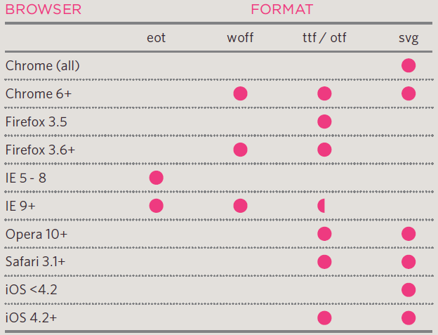

# Class 05

## Images

Images could be used in a website for many reasons, for a logo, for a background, or maybe just to show it on your website as a content. To choose an image for your website, it has to be relevant to your content, fits the color palette used in the website, and be instantly recongisable.
The best way to store images is to add all of them to one folder called images, instead of having them in the root of the website. HTML has a specific tag to insert an image to website which is ``, and it's a self-closing tag. Inside the `` tag you can add `src` attribute, and its value should be the path of the URL of the image you want to insert.
There are many types of images, but each type of image should be saved in a specific format in order to get its best resoultion. Photographs are best saved as JPEGs, illustrations or logos that use flat colors are better saved as GIFs.

Example:

```html

```

## Colors

Colors can bring a website to life. Many elements in your website need color in a way or another. Font color, background color, and border color are examples on what colors can do to elemets.
There are three ways to specify colors in CSS: RGB values, hex codes, and color names. In additon to these ways, CSS3 also allows you to specify colors as HSL values, with an optional opacity value. It is known as HSLA. If you don't know the name of the color you need, you can user the color picker which can help you to find the color you want.

Example:

```css
h1{
    color: red;
}
body{
    background-color: #ffffff;
}
p{
    border-color: rgb(0,0,0);
}
```

## Text

In CSS you can control the appearance of text and that can be split into two groups: The poperties that directly affect the font and its appearance, and the properties that same effect on text no matter what font is being used. Choosing a typeface to your website it is important to understand that browsers will usually only display the font if its installed on the user's device.
There are many ways to specify the size of the font such as pixels, percentage, and ems. Other properties can be controlled in a text such as the alignment, the space between lines, the space between characters, the weight of the text, transformation of text, and the style and the decoration of text.

The image below shows font formats and what browsers support them:

