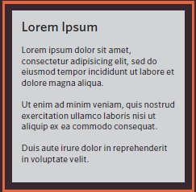
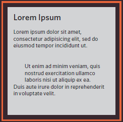
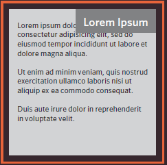
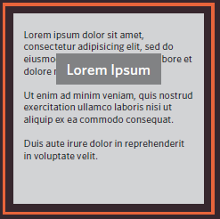
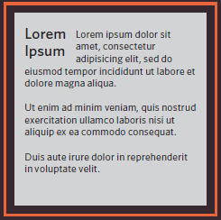
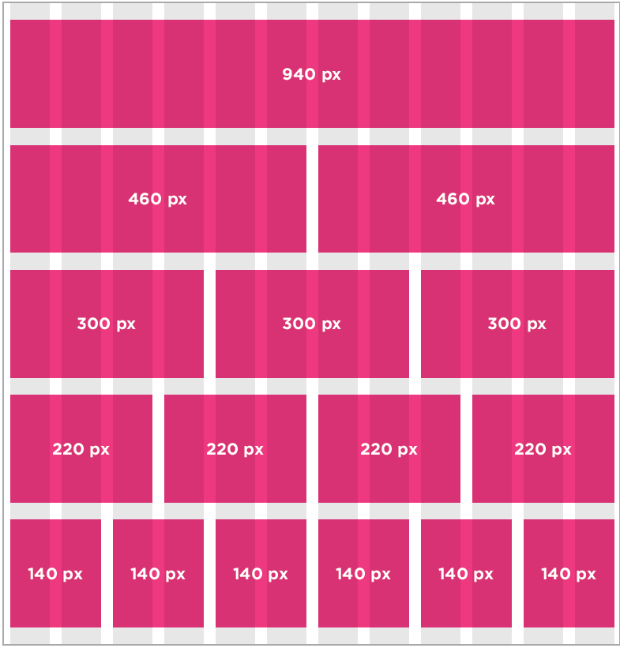
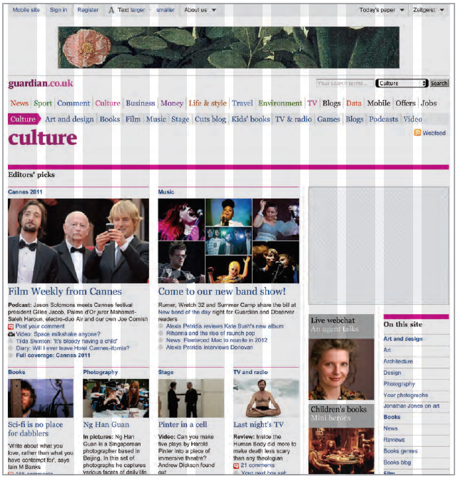

# Class 08

## Layout

Browsers display pages in normal flow unless you specify relative, absolute, or fixed position. Normal flow means that every block-level element appears on a mew line. Relative positioning moves an element from the position it would be in nomal flow, shifting it to the top, right, bottom, left of where it would have been placed. Absolute poisioning positions the elmement in relation to its containing element and it takes it out of normal flow.
Also, fixed positioning is a form of absolute positioning that positions the element in relation to the browser window. Floating elements in the othe hand allows you to take that element out of normal flow and position it to the far left or right of a containing box.

The table below shows some of CSS positioning properties and values and what they do.

| Property | What it does | imf |
|----|----|----|
| `position: static;` | Default positiont value |  |
| `position: relative;` | Relative positioning moves an element in relation to where it would have been in normal flow. |  |
| `position:absolute;` | box is taken out of normal flow and no longer affects the position of other elements on the page |  |
| `position:fixed;` | is a type of absolute positioning that requires the position property to have a value of fixed |  |
| `float: value;` | allows you to take an element in normal flow and place it as far to the left or right of the containing element as possible |  |
| `z-index: value;` | control which element sits on top when elements are covering one another |

Layout has two type: Fixed Width Layouts and Liquid Layouts. Fixed width layout designs do not change size as the user increases or decreases the size of their browser window Measurements tend to be given in pixels. While liquid layout designs stretch and contract as the user increases or decreases the size of their browser window. They tend to use percentages.
Many designers use a grid structure to help them position items on a page, and the same is true for web designers. Grids set consistent proportions and spaces between items which helps to create a professional looking design. CSS frameworks aim to make your life easier by providing the code for common tasks, such as creating layout grids, styling forms, creating printer-friendly versions of pages and so on. You can include the CSS framework code in your projects rather than writing the CSS from scratch as you can include multiple CSS files in one page. If the same taks needs to be done agian, its better to write it into a function and call the function whenever this task is needed.

The table below shows the resoultion of different screens:

|Screen | Resolution |
|----|----|
| Mobile screen | 320px to 767px |
| Tablet screen | 768px to 991px |
| Laptop screens | 992px t ≃ 1200px|
| Desktop screen | => 1200px |

The image below shows an example on a grid and how it could be divided into a different numbers of columns:

The image below shows an example of a website uses grid:

[Back to Home](README.md)
