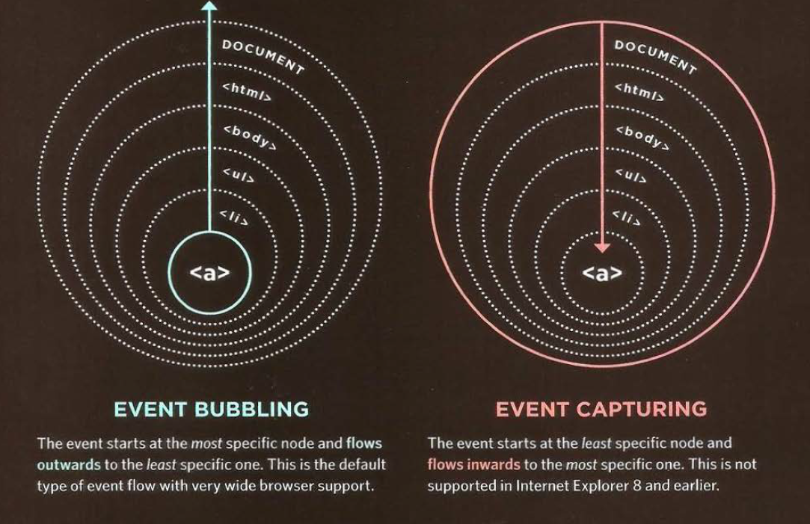

# Class 09

## Forms

Forms in HTML are a way to collect information from a website's visitors. Forms could be just as a search box, registraion form, or even a newsletter subscription form. HTML provides a set of elements to collect data from users based on the type of the data, for example, there is the `<input type=text>` to collect regular text, `<input type=password>` for paswords where the characters of the password won't appear on the screen. For making choices, HTML offers radio buttons for one choice out of many, and checkboxes for multiple choices, and also there is select element which could be only for one choice or multiple choices. All of the data inputs that are needed for one form should be wrapped in a `<form></form>` tag.

## CSS for Lists, Tables and Forms

As for any other elements, forms, tables and lists have specefic CSS properties for each one of them in addition to the other properties that all elements share. For lists, you can specify the style of the bullets using the `list-style-type` property, change their positon using the `list-style-position` property, or even replace them with images using the `list-style-image` property.
For tables, you can shade aternate rows using `tr:even` or `tr:odd`, you can also hide or show empty cells using `empty-cells` property, you can also control the gap between the cells using `border-spacing` and `border-collapse` properties.
For forms, it's common to style text feilds, submit buttons, and labels using the common properties such as `font-size`, `color`, `border` and other properties. Forms are easier to use if the form controls are vertically aligned using CSS. Also, forms benefit from styles that make them feel more
interactive.

## Events

Evenet are the browser's way of saying, "Hey, this just happened." such as clicking on a button, scrolling, or even filling you information in a form. Your script can then respond to these events. 

The table below a list of events and their description:

| Event | Type | Description |
|----|----|----|
| load | UI EVENT | Web page has finished loading |
| unload | UI EVENT | Web page is unloading (usually because a new page was requested) |
| error | UI EVENT | Browser encounters a JavaScript error or an asset doesn't exist |
| resize | UI EVENT | Browser window has been resized |
| scroll | UI EVENT | User has scrolled up or down the page |
| keydown | KEYBOARD EVENT | User first presses a key (repeats while key is depressed) |
| keyup | KEYBOARD EVENT | User releases a key |
| keypress | KEYBOARD EVENT | Character is being inserted (repeats while key is depressed) |
| click | MOUSE EVENT | User presses and releases a button over the same element |
| dblclick | MOUSE EVENT | User presses and releases a button twice over the same element |
| moused own | MOUSE EVENT | User presses a mouse button while over an element |
| mouseup | MOUSE EVENT | User releases a mouse button while over an element |
| mousemove | MOUSE EVENT | User moves the mouse (not on a touchscreen) |
| mouseover | MOUSE EVENT | User moves the mouse over an element (not on a touchscreen) |
| mouseout | MOUSE EVENT | User moves the mouse off an element (not on a touchscreen) |

There are other types events dedicated for specific things such as forms.

Binding is the process of stating which event you are waiting to happen, and which element you are waiting for that event to happen upon. When an event occurs on an element, it can trigger a JavaScript function. When this function then changes the web page in some way, it feels interactive because it has responded to the user. You can use event delegation to monitor for events that happen on all of the children of an element. The most commonly used events are W3C DOM events, although there are others in the HTMLS specification as well as browser-specific events.

The image below shows the difference between Event Bubbling and Event Capturing:

[Back to Home](README.md)
