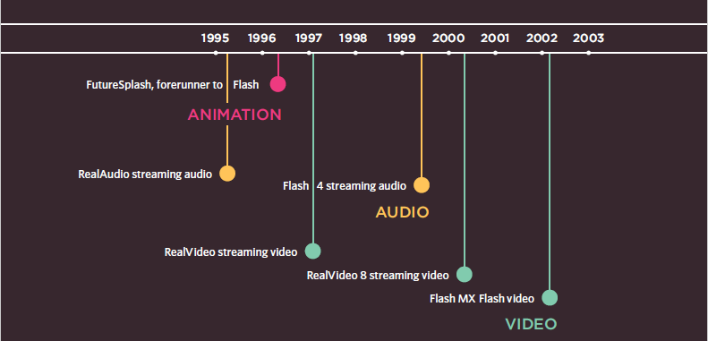
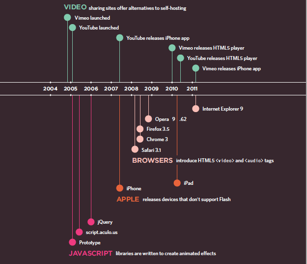

# Class 11

## Images

By usning CSS, we can control the style of images used in our website, such as the width of the image, tjhe alignment, and many other properties. The `width` and `height` properties helps develoers to select teh width and height used for images to fit their designs. The `float` property controls the alignment of the image in its parent section wherther to right or to left. Also, an image can be centered using the following to properties and their values `display: block;` and `margin: auto;`.

As images can be used as backgrounds in HTML; there are some CSS properties that control that such as `background-image` which sets a specific image as a background to the selected element. You can also control the size of the background using `background-size`, the posisition of it using `background-position` and also if the background image gets repated or not using `background-repeat`.

You can create image rollover effects by moving the background position of an image. To reduce the number of images your browser has to load, you can create image sprites.

## Practical Information

Search engine optimization (or SEO) is the practice of trying to help your site appear nearer the top of search engine results that your website covers. On-page techniques are the methods you can use on your web pages to improve their rating in search engines. The main component of this is looking at keywords that people are likely to enter into a search engine if they wanted to find your site, and then including these in the text and HTML code for your site in order to help the search engines know that your site covers these topics. Ensuring that any images have appropriate text in the value of their alt attribute also helps search engines understand the content of images. Search engines also look at the words between the opening `<a>` tag and closing `</a>` tag in the link. If the text in the link contains keywords (rather than just click here or your website address) it may be considered more relevant. The words that appear in links to your site should also appear in the text of the page that the site links to.

The following things should be considered when building each web page:

1. Page Title: The page title appears at the top of the browser window or on the tab of a browser. It is specified in the `<title>` element which lives inside the `<head>` element.

2. URL / Web Address: The name of the file is part of the URL. Where possible, use keywords in the file name.
3. Headings: If the keywords are in a heading `<hn>` element then a search engine will know that this page is all about that subject and give it greater weight than other text.
4. Text: Where possible, it helps to repeat the keywords in the main body of the text at least 2-3 times. Do not, however, over-use these terms, because the text must be easy for a human to read.
5. Link Text: Use keywords in the text that create links between pages (rather than using generic expressions such as "click here").
6. Image Alt Text: Search engines rely on you providing accurate descriptions of images in the alt text. This will also help your images show up in the results of image-based searches.
7. Page Descriptions: The description also lives inside the `<head>` element and is specified using a `<meta>` tag. It should be a sentence that describes the content of the page.

Analytics tools such as Google Analytics allow you to see how many people visit your site, how they find it, and what they do when they get there. To put your site on the web, you will need to obtain a domain name and web hosting. Many companies provide platforms for blogging, email newsletters, e-commerce and other popular website tools (to save you writing them from scratch).

## Flash, Video & Audio

Flash is a very popular technology used to add animations, video, and audio to websites. Since the late 1990s, Flash has been a very popular tool for creating animations, and later for playing audio and video in websites.

The two images below shows the timeline of how web technologies changed rapidly since 1995 to 2011:





You cabn add videos and audio fils to your website using the `<video>` and `<audio>` tags. The `controls` attribute enables the default set of playback controls. If you don't specify this, you get no playback controls:

Example:

```html

<video controls>
  <source src="rabbit320.mp4" type="video/mp4">
  <source src="rabbit320.webm" type="video/webm">
  <p>Your browser doesn't support HTML5 video. Here is a <a href="rabbit320.mp4">link to the video</a> instead.</p>
</video>

```

[Back to Home](README.md)
